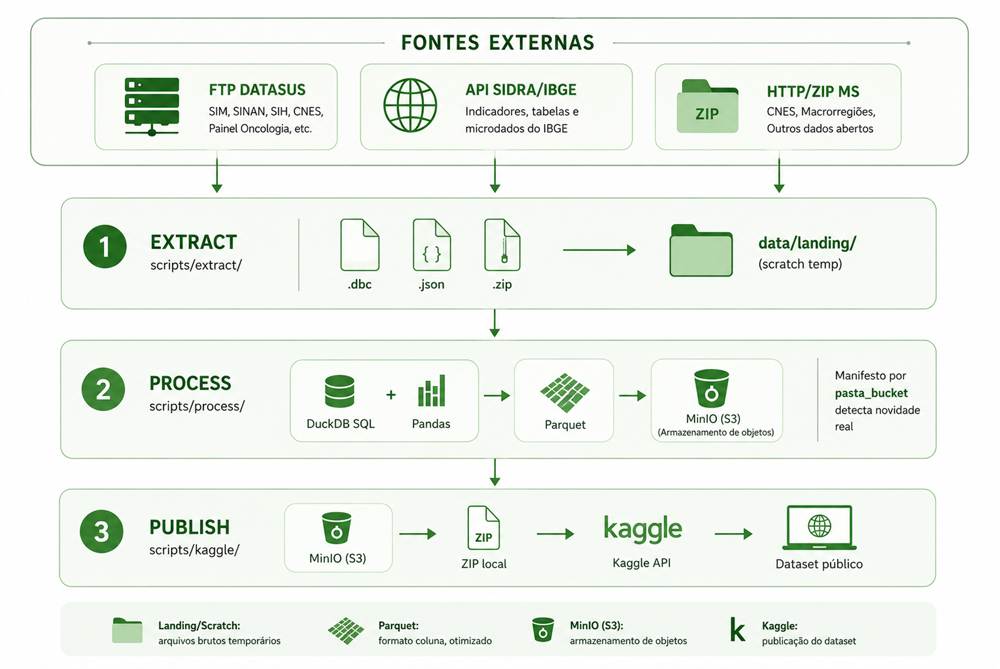

[](LICENSE)
[](https://www.kaggle.com/datasets/rafatrindade/brazilian-kaggle-datahub)
[](https://github.com/rafa-trindade/kaggle-datahub)

O **DataHub Brasil** nasce de uma necessidade prática: dados públicos brasileiros de altíssimo valor existem, são gratuitos e são oficiais - mas estão espalhados entre sistemas diferentes do DATASUS e do IBGE, cada um com seu próprio protocolo de acesso, formato de arquivo e convenção de nomenclatura. Reunir qualquer análise minimamente ampla exige garimpar meia dúzia de fontes antes de escrever a primeira linha de código de análise.

Este é um hub bruto e geral de dados públicos do Brasil: mortalidade, nascimentos, rede assistencial completa (estabelecimentos, habilitações, leitos, profissionais, equipamentos), internações hospitalares, dezenas de doenças de notificação compulsória, população e PIB por município além dos microdados completos da Pesquisa Nacional de Saúde - sem recorte temático, sem filtro de especialidade, sem viés de pesquisa específica. A ideia é justamente o oposto de um recorte: publicar cada sistema por completo, do jeito mais próximo possível do dado oficial, para que qualquer pesquisador possa aplicar seu próprio filtro.

O dataset final está disponível no [Kaggle](https://www.kaggle.com/datasets/rafatrindade/brazilian-kaggle-datahub), com um [notebook de exemplo](https://www.kaggle.com/code/rafatrindade/taxa-de-incid-ncia-de-doen-as-por-munic-pio) demonstrando como cruzar as bases (doenças de notificação compulsória e população, por município) para calcular taxa de incidência por 100 mil habitantes. Cobre diferentes dimensões da saúde pública e demografia do Brasil: desde onde a rede está habilitada a atender e quantos leitos ela tem, até quem nasce, quem morre, quais doenças são notificadas, e como a população e a economia de cada município evoluem ao longo do tempo. 

📄 [Documentação técnica oficial](https://github.com/rafa-trindade/kaggle-datahub/releases/download/docs-v1/documentacao.rar) do DATASUS/IBGE (dicionários, mapeamentos e layouts).

---

## 🏗️ Arquitetura do Pipeline



> Não existe uma pasta local persistida com o histórico completo de dados brutos. `data/landing/` é puramente um scratch space temporário - cada arquivo é baixado, processado e enviado direto ao bucket, com o local sendo apagado logo em seguida. A detecção de "isso já existe, não precisa reprocessar" é feita comparando contra um **manifesto** (`_manifest.json`) mantido no próprio bucket, não contra disco local.

---

## 💼 Aplicações Corporativas e Consultoria

Embora este pipeline seja de código aberto para a comunidade, a estruturação e manutenção de Data Lakes na área da saúde exige governança, segurança e customização. O **DataHub Brasil** pode ser o motor de dados da sua instituição. 

Casos de uso corporativos reais que podem ser construídos a partir desta arquitetura:
* **Hospitais e Operadoras de Saúde:** Cruzamento de dados de mortalidade (SIM) e nascimentos (SINASC) com bases internas para modelos preditivos de risco e dimensionamento de rede assistencial.
* **Healthtechs:** Alimentação automatizada de bancos de dados proprietários via pipelines customizados, utilizando os dados de infraestrutura do CNES e faturamento do SIA/SIH.
* **Indústria Farmacêutica e Pesquisa:** Mapeamento geolocalizado de incidência de doenças de notificação compulsória (SINAN) para direcionamento de estudos clínicos, campanhas e distribuição de medicamentos.

📩 **Quer implementar uma solução robusta de dados de saúde na sua empresa?** 
[Fale comigo no LinkedIn](https://www.linkedin.com/in/rafatrindade/) para consultoria técnica especializada, implantação de arquitetura em nuvem e produtização de modelos de dados.

---

## 📊 Fontes de Dados e Escopo

### **1. Mortalidade (Fonte: SIM - DATASUS)**

O **Sistema de Informações sobre Mortalidade (SIM)** consolida as Declarações de Óbito de todo o país desde 1979. Aqui, o SIM é publicado **por completo**, em todos os seus subsistemas, sem recorte por causa de óbito.

**Escopo e Processamento:** São baixados via FTP público do DATASUS os arquivos `.dbc` de cada subsistema, nas eras CID-9 (1979-1995) e CID-10 (1996-atual, quando aplicável), convertidos para Parquet e mesclados incrementalmente - execuções futuras só baixam e reprocessam o que for novo, sem reprocessar o histórico inteiro. Descoberta importante durante a construção: os subsistemas de Causas Externas, Óbitos Fetais, Óbitos Infantis e Óbitos Maternos não ficam em pastas próprias no FTP do DATASUS - todos dividem a mesma pasta física (nomeada "DOFET" por herança histórica), diferenciados só pelo prefixo do nome do arquivo.

**Bases disponibilizadas:**

- `declaracoes_de_obito_cid9.parquet` / `declaracoes_de_obito_cid10.parquet` - Declarações de óbito, todas as causas, 1979-1995 e 1996-atual.
- `declaracoes_de_obito_causas_externas_cid9.parquet` / `_cid10.parquet` - Óbitos por causas externas (acidentes, violência).
- `declaracoes_de_obito_fetais_cid9.parquet` / `_cid10.parquet` - Óbitos fetais.
- `declaracoes_de_obito_infantis_cid9.parquet` / `_cid10.parquet` - Óbitos infantis.
- `declaracoes_de_obito_maternos_cid10.parquet` - Óbitos maternos (só existe a partir de 1996, sem era CID-9).
- `declaracoes_de_obito_residentes_exterior_cid10.parquet` - Óbitos de brasileiros residentes no exterior (só a partir de 2013).

> BRASIL. Ministério da Saúde. DATASUS. *Sistema de Informações sobre Mortalidade (SIM)*. Brasília, DF: Ministério da Saúde. Disponível em: <https://datasus.saude.gov.br/mortalidade-desde-1996-pela-cid-10>.

---

### **2. Nascimentos (Fonte: SINASC - DATASUS)**

O **Sistema de Informações sobre Nascidos Vivos (SINASC)** é o equivalente do SIM para nascimentos - a base oficial de natalidade do Brasil desde 1996 (com dados pré-1996 também disponíveis).

**Escopo e Processamento:** Baixado via FTP público do DATASUS, com uma descoberta relevante durante a construção: a pasta `SINASC/NOV/DNRES` (aparentemente o caminho "principal") está **desatualizada** em relação à pasta `SINASC/1996_/Dados/DNRES`, que é a de fato mantida corrente - o pipeline usa a segunda. Os arquivos consolidados nacionais por ano (`DNBR{AAAA}.dbc`) são deliberadamente excluídos do processamento por duplicarem integralmente os nascimentos já presentes nos arquivos por UF (confirmado empiricamente, contagem exata).

**Bases disponibilizadas:**

- `declaracoes_de_nascido_vivo.parquet` - Nascidos vivos por UF, 1994-atual.
- `declaracoes_de_nascido_vivo_exterior.parquet` - Brasileiros nascidos no exterior, registrados no sistema.

> BRASIL. Ministério da Saúde. DATASUS. *Sistema de Informações sobre Nascidos Vivos (SINASC)*. Brasília, DF: Ministério da Saúde. Disponível em: <https://datasus.saude.gov.br/nascidos-vivos-desde-1994/>.

---

### **3. Rede Assistencial Completa (Fonte: CNES - DATASUS)**

O **Cadastro Nacional de Estabelecimentos de Saúde (CNES)** é o registro oficial de todos os estabelecimentos de saúde do Brasil. Aqui, cada arquivo do CNES é publicado **por completo, sem filtro de especialidade**, mantendo a granularidade original de cada sistema.

**Escopo e Processamento:** O cadastro de Estabelecimentos vem via HTTP/ZIP dos Dados Abertos do Ministério da Saúde. Habilitações, Leitos, Profissionais e Equipamentos vêm via FTP, organizados por UF e competência - como o CNES é um **retrato** (não uma série histórica que acumula), cada nova competência **substitui por completo** a anterior, ao contrário do padrão de mesclagem incremental usado no SIM/SINASC.

**Bases disponibilizadas:**

- `estabelecimentos_de_saude.parquet` - Cadastro geral: identificação, endereço, CNPJ, infraestrutura.
- `habilitacoes.parquet` - Todas as habilitações de todos os estabelecimentos, todas as especialidades.
- `leitos.parquet` - Contagem de leitos por estabelecimento e tipo.
- `profissionais.parquet` - Profissionais de saúde cadastrados (CBO, carga horária, forma de contratação).
- `equipamentos.parquet` - Equipamentos cadastrados por estabelecimento (raio-X, ressonância, tomógrafo etc).

> BRASIL. Ministério da Saúde. DATASUS. *Cadastro Nacional de Estabelecimentos de Saúde (CNES)*. Brasília, DF: Ministério da Saúde. Disponível em: <https://cnes.datasus.gov.br/>.

---

### **4. Internações Hospitalares (Fonte: SIH/SUS - DATASUS)**

O **Sistema de Informações Hospitalares (SIH/SUS)** registra todas as internações realizadas pelo SUS, com diagnósticos, procedimentos, valores e tempo de permanência.

**Escopo e Processamento:** Cobre a série moderna (2008-atual) - a série anterior (1992-2007) foi deixada de fora por decisão de escopo, dado o volume já considerável só na série recente (~6.000 arquivos por subsistema, um por UF/mês). São publicados os 3 subsistemas que compõem o SIH: internações aprovadas, rejeitadas, e os atos médicos associados.

**Bases disponibilizadas:**

- `aih_reduzida.parquet` - Internações aprovadas para pagamento pelo SUS (RD).
- `aih_rejeitada.parquet` - Internações rejeitadas para pagamento (RJ).
- `servicos_profissionais.parquet` - Atos médicos realizados durante as internações (SP).

> BRASIL. Ministério da Saúde. DATASUS. *Sistema de Informações Hospitalares do SUS (SIH/SUS)*. Brasília, DF: Ministério da Saúde. Disponível em: <https://datasus.saude.gov.br/acesso-a-informacao/producao-hospitalar-sih-sus/>.

---

### **5. Produção Ambulatorial (Fonte: SIA/SUS - DATASUS)** &nbsp;`🚧 EM DESENVOLVIMENTO`

> 🚧 **Esta fonte está em desenvolvimento.**

O **Sistema de Informações Ambulatoriais (SIA/SUS)** registra toda a produção ambulatorial do SUS - de procedimentos de baixa complexidade (BPA) às autorizações de procedimentos de alta complexidade (APAC): quimioterapia, radioterapia, diálise, medicamentos especializados, entre outros.

**Escopo e Processamento:** Baixados via FTP público do DATASUS os arquivos `.dbc` de cada subsistema (um por UF/mês), diferenciados pelo prefixo do nome do arquivo, convertidos para Parquet e mesclados incrementalmente - mesma mecânica do SIM/SIH. A série moderna vive em `SIASUS/200801_/Dados`; a Produção Ambulatorial (PA), por começar em Jul/1994, também é varrida na pasta legada `SIASUS/199407_200712/Dados`. Alguns prefixos são prefixo um do outro (ex.: `AB` vs `ABO`), então o filtro valida o comprimento exato de `{UF}{AAMM}` para não haver captura cruzada.

**Bases disponibilizadas:**

- `producao_ambulatorial/` - Produção ambulatorial (BPA), Jul/1994-atual. **Particionada por competência** (ver nota abaixo). &nbsp;`🚧`
- `apac_medicamentos.parquet` - APAC de medicamentos, Jan/2008-atual. &nbsp;`🚧`
- `apac_quimioterapia.parquet` - APAC de quimioterapia, Jan/2008-atual. &nbsp;`🚧`
- `apac_radioterapia.parquet` - APAC de radioterapia, Jan/2008-atual. &nbsp;`🚧`
- `apac_tratamento_dialitico.parquet` - APAC de tratamento dialítico, Jun/2014-atual. &nbsp;`🚧`
- `apac_nefrologia.parquet` - APAC de nefrologia, Jan/2008 a Out/2014 (substituída pela ATD). &nbsp;`🚧`
- `apac_laudos_diversos.parquet` - APAC de laudos diversos, Jan/2008-atual. &nbsp;`🚧`
- `psicossocial.parquet` - RAAS Psicossocial (CAPS), Jan/2013-atual. &nbsp;`🚧`
- `atencao_domiciliar.parquet` - RAAS de Atenção Domiciliar (SAD), Nov/2012-atual. &nbsp;`🚧`
- `apac_confeccao_fistula.parquet` - APAC de confecção de fístula arteriovenosa, Jun/2014-atual. &nbsp;`🚧`
- `apac_cirurgia_bariatrica.parquet` - APAC de acompanhamento a cirurgia bariátrica, Jan/2008 a Mar/2013. &nbsp;`🚧`
- `apac_pos_cirurgia_bariatrica.parquet` - APAC de acompanhamento pós cirurgia bariátrica, Abr/2013-atual. &nbsp;`🚧`

#### Nota sobre a Produção Ambulatorial (PA) &nbsp;`🚧 EM DESENVOLVIMENTO`

A PA é, de longe, a maior base do DATASUS: mais de 10 mil arquivos `.dbc` e dezenas de GB, com série desde Jul/1994. Por isso ela recebe um tratamento distinto das demais fontes, que viram um único parquet consolidado:

- **Particionamento por competência.** Em vez de um único `producao_ambulatorial.parquet`, a PA é publicada como uma pasta `producao_ambulatorial/` contendo um parquet por competência mensal, nomeado `producao_ambulatorial_AAAAMM.parquet` (ex.: `producao_ambulatorial_202604.parquet`). O ano de 4 dígitos faz a ordenação alfabética coincidir com a cronológica. Competências grandes que o DATASUS fatia em partes (ex.: `PASP2401a/b.dbc`) são unificadas no parquet daquela competência.
- **Dataset Kaggle dedicado.** Pelo volume (que sozinho se aproxima do teto de 200 GB do Kaggle) e pelo modelo de publicação do dataset principal, a PA é publicada num **dataset Kaggle separado** (`sia-producao-ambulatorial`), vinculado ao principal por descrição. Isso isola o custo de reenvio e protege a estabilidade do dataset principal.


> BRASIL. Ministério da Saúde. DATASUS. *Sistema de Informações Ambulatoriais do SUS (SIA/SUS)*. Brasília, DF: Ministério da Saúde. Disponível em: <https://datasus.saude.gov.br/acesso-a-informacao/producao-ambulatorial-sia-sus/>.

---

### **6. Comunicação Hospitalar e Ambulatorial (Fonte: CIHA - DATASUS)** &nbsp;`🚧 EM DESENVOLVIMENTO`

> 🚧 **Esta fonte está em desenvolvimento.**

O **Sistema de Comunicação de Informação Hospitalar e Ambulatorial (CIHA)** registra internações e atendimentos ambulatoriais comunicados ao SUS, incluindo a produção **não-SUS** (particular e planos de saúde) - o que o torna complementar ao SIH/SIA, restritos à produção paga pelo SUS. Sucede o antigo CIH (2008-2010).

**Escopo e Processamento:** Baixado via FTP público do DATASUS (`CIHA/201101_/Dados`, arquivos `CIHA{UF}{AAMM}.dbc`, um por UF/mês), convertido para Parquet e mesclado incrementalmente - mesma mecânica do SIM/SIH. Série acumulativa a partir de Jan/2011.

**Base disponibilizada:**

- `comunicacao_internacao_hospitalar_ambulatorial.parquet` - Internações e atendimentos comunicados (inclui não-SUS), Jan/2011-atual. &nbsp;`🚧`

> BRASIL. Ministério da Saúde. DATASUS. *Sistema de Comunicação de Informação Hospitalar e Ambulatorial (CIHA)*. Brasília, DF: Ministério da Saúde. Disponível em: <http://ciha.datasus.gov.br/CIHA/index.php>.

---

### **7. Doenças de Notificação Compulsória (Fonte: SINAN - DATASUS)**

O **Sistema de Informação de Agravos de Notificação (SINAN)** registra todas as doenças e agravos de notificação obrigatória no Brasil - de arboviroses a doenças ocupacionais, de violência interpessoal a doenças quase erradicadas mantidas sob vigilância ativa.

**Escopo e Processamento:** Diferente do SIM/SIH, o SINAN não é dividido por UF - cada agravo tem um único arquivo por ano, nível Brasil. São cobertos **58 agravos**, cada um publicado como um Parquet **independente** (agravos diferentes têm estruturas de campos completamente diferentes entre si, então misturar tudo numa tabela só não faria sentido). A lista completa de agravos e seus respectivos códigos está documentada em `scripts/config/agravos_sinan.py` no repositório de código. Entre os destaques: as três arboviroses (dengue, chikungunya, zika), tuberculose, hanseníase, sífilis (adquirida/congênita/gestante), HIV e AIDS (notificados como 6 sistemas separados - adulto/criança/gestante para cada), e violência interpessoal/autoprovocada, publicada aqui **sem nenhum filtro** (todos os desfechos, todos os gêneros).

**Bases disponibilizadas:** 58 arquivos Parquet, um por agravo, nomeados de forma legível (ex: `dengue.parquet`, `tuberculose.parquet`, `violencia_interpessoal_autoprovocada.parquet`, `hiv_gestante.parquet`) - não pelas siglas técnicas do DATASUS.

> BRASIL. Ministério da Saúde. DATASUS. *Sistema de Informação de Agravos de Notificação (SINAN)*. Brasília, DF: Ministério da Saúde. Disponível em: <https://datasus.saude.gov.br/sinan/>.

---

### **8. Demografia e Economia Municipal (Fonte: IBGE, via API SIDRA)**

O **IBGE**, via sua API pública SIDRA, disponibiliza séries anuais de população estimada e produto interno bruto por município.

**Escopo e Processamento:** Ambas as séries são obtidas ano a ano via API (não por download de arquivo), com descoberta dinâmica dos períodos realmente disponíveis em cada tabela - o IBGE costuma trocar o número da tabela quando muda a metodologia de cálculo (confirmado empiricamente ao longo da construção: uma tentativa inicial usou uma tabela que só cobria nível Brasil, não municipal).

**Bases disponibilizadas:**

- `populacao_estimada.parquet` - População estimada por município, 2001-atual (com lacunas nos anos de Censo/Contagem, quando a estimativa regular é substituída).
- `pib_municipal.parquet` - Produto Interno Bruto por município, 2002-atual.

> INSTITUTO BRASILEIRO DE GEOGRAFIA E ESTATÍSTICA (IBGE). *Sistema IBGE de Recuperação Automática (SIDRA)*. Rio de Janeiro: IBGE. Disponível em: <https://sidra.ibge.gov.br/>.

---

### **9. Microdados Completos da PNS (Fonte: IBGE)**

A **Pesquisa Nacional de Saúde (PNS)** é um inquérito domiciliar do IBGE com mais de 1.000 variáveis por edição, cobrindo desde diagnósticos autorreferidos até hábitos de vida e acesso a serviços de saúde.

**Escopo e Processamento:** Aqui os microdados de posição fixa são publicados **exatamente como o IBGE distribui** - sem decodificar nenhuma variável, sem recorte temático. Mapear as mais de 1.000 posições de cada edição não agregaria valor suficiente para este hub geral; quem for usar precisa do dicionário oficial de posições do IBGE para decodificar campo a campo.

**Bases disponibilizadas:**

- `microdados_pns_2013.txt` / `microdados_pns_2019.txt` - Microdados brutos de posição fixa, tal como distribuídos pelo IBGE.

*Observação: por serem arquivos volumosos e sujeitos aos termos de uso de download do IBGE, os microdados brutos são obtidos manualmente, não via automação.*

> INSTITUTO BRASILEIRO DE GEOGRAFIA E ESTATÍSTICA (IBGE). *Pesquisa Nacional de Saúde (PNS)*. Rio de Janeiro: IBGE. Disponível em: <https://www.ibge.gov.br/estatisticas/sociais/saude/9160-pesquisa-nacional-de-saude.html>.

---

### **10. Base Auxiliar (Macrorregião de Saúde)**

Para permitir cruzamentos geográficos entre as demais bases, o projeto conta com uma base auxiliar de referência, construída a partir de dados abertos do Ministério da Saúde.

**Escopo e Processamento:** O arquivo de municípios (Dados Abertos da Saúde) é combinado, via join no código do município (com correção de zero à esquerda), com um arquivo complementar de geolocalização.

**Base disponibilizada:**

- `macroregiao_de_saude.parquet` - Municípios brasileiros associados às suas macrorregiões de saúde, regiões de saúde e coordenadas geográficas.

---

## 🗓️ Cobertura Histórica

- **SIM (mortalidade):** 1979-atual, todos os 6 subsistemas.
- **SINASC (nascimentos):** 1994-atual.
- **CNES (rede assistencial):** retrato da competência mais recente disponível (não histórico).
- **SIH/SUS (internações):** 2008-atual (série moderna).
- **SIA/SUS (produção ambulatorial):** varia por subsistema - PA desde Jul/1994, APACs em geral desde Jan/2008; ver a seção da fonte para o intervalo de cada base. &nbsp;`🚧 EM DESENVOLVIMENTO`
- **CIHA (comunicação hosp./ambulatorial):** 2011-atual. &nbsp;`🚧 EM DESENVOLVIMENTO`
- **SINAN (agravos):** varia por agravo, geralmente a partir dos anos 2000; consultar `agravos_sinan.py` para o início exato de cada um.
- **IBGE (população/PIB):** população desde 2001, PIB desde 2002.
- **PNS/IBGE:** edições pontuais de 2013 e 2019.

---

## 🔄 Atualização e Confiabilidade

- **SIM, SINASC, CNES, SIH, SINAN:** sincronização totalmente automatizada via FTP, com detecção de novidade real (por tamanho de arquivo) antes de reprocessar ou publicar.
- **SIA/SUS, CIHA:** sincronização automatizada via FTP, mesma mecânica das demais fontes DATASUS. &nbsp;`🚧 EM DESENVOLVIMENTO`
- **IBGE (População/PIB):** sincronização automatizada via API, ano a ano, com descoberta dinâmica de quais anos a tabela realmente cobre.
- **PNS/IBGE:** obtenção do microdado bruto é manual; a publicação (upload, sem transformação) é automatizada.
- **Macrorregião de Saúde:** sincronização automatizada via HTTP.

O pipeline só publica uma nova versão (bucket + Kaggle) quando pelo menos uma fonte automatizada reporta dado novo de verdade.

---

## 📁 Estrutura de Pastas do Dataset

```
sim/
  declaracoes_de_obito_cid9.parquet
  declaracoes_de_obito_cid10.parquet
  declaracoes_de_obito_causas_externas_cid9.parquet
  declaracoes_de_obito_causas_externas_cid10.parquet
  declaracoes_de_obito_fetais_cid9.parquet
  declaracoes_de_obito_fetais_cid10.parquet
  declaracoes_de_obito_infantis_cid9.parquet
  declaracoes_de_obito_infantis_cid10.parquet
  declaracoes_de_obito_maternos_cid10.parquet
  declaracoes_de_obito_residentes_exterior_cid10.parquet

sinasc/
  declaracoes_de_nascido_vivo.parquet
  declaracoes_de_nascido_vivo_exterior.parquet

cnes/
  estabelecimentos_de_saude.parquet
  habilitacoes.parquet
  leitos.parquet
  profissionais.parquet
  equipamentos.parquet

sih/
  aih_reduzida.parquet
  aih_rejeitada.parquet
  servicos_profissionais.parquet

sia/                                    # 🚧 EM DESENVOLVIMENTO
  apac_medicamentos.parquet
  apac_quimioterapia.parquet
  apac_radioterapia.parquet
  apac_tratamento_dialitico.parquet
  apac_nefrologia.parquet
  apac_laudos_diversos.parquet
  psicossocial.parquet
  atencao_domiciliar.parquet
  apac_confeccao_fistula.parquet
  apac_cirurgia_bariatrica.parquet
  apac_pos_cirurgia_bariatrica.parquet

producao_ambulatorial/                  # 🚧 PA -- particionada, dataset Kaggle dedicado
  producao_ambulatorial_199407.parquet
  producao_ambulatorial_199408.parquet
  ...
  producao_ambulatorial_202604.parquet
  _manifest.json

ciha/                                   # 🚧 EM DESENVOLVIMENTO
  comunicacao_internacao_hospitalar_ambulatorial.parquet

sinan/
  dengue.parquet, tuberculose.parquet, hanseniase.parquet, ...
  (58 arquivos no total -- lista completa em scripts/config/agravos_sinan.py)

geo/
  macroregiao_de_saude.parquet

ibge/
  populacao_estimada.parquet
  pib_municipal.parquet
  microdados_pns_2013.txt
  microdados_pns_2019.txt

metadados.csv          -- manifesto de todos os arquivos: fonte(s), tamanho,
                           contagem de registros, data de modificação
```

Uma cópia local do `metadados.csv` também fica versionada em `data/metadados.csv`
neste repositório -- único arquivo persistente em `data/` (todo o resto é
scratch space temporário, ver Arquitetura do Pipeline acima).

---

## 🛠️ Stack Tecnológico

| Camada | Tecnologia |
|---|---|
| Linguagem | Python 3.11 |
| Processamento analítico | DuckDB |
| Manipulação de dados | Pandas |
| Armazenamento (Data Lake) | MinIO - Object Storage compatível com S3 |
| Comunicação S3 | boto3 |
| Distribuição | Kaggle Python SDK (`kaggle`) |
| Configuração | python-dotenv |

---

### Executando o pipeline

> ⚠️ **PNS 2013 e 2019**: os microdados devem ser baixados manualmente no [site do IBGE](https://www.ibge.gov.br/estatisticas/sociais/saude/9160-pesquisa-nacional-de-saude.html) e salvos em `data/landing/ibge/` como `PNS_2013.txt` e `PNS_2019.txt`.
>
> ⚠️ **Macrorregiões**: o arquivo `macro_geolocalizacao.xls` deve estar presente em `data/landing/csv_macroregiao/` antes de executar o processamento.

A lista completa de fontes, com seus respectivos módulos de extração e processamento, está em `scripts/config/fontes.py`.

**Gerar o manifesto de metadados** (roda a qualquer momento, lista o bucket real e não depende de nenhuma fonte específica ter rodado antes)

```bash
python -m scripts.process.process_metadados
```

**Publicação no Kaggle**

```bash
python -m scripts.kaggle.load_kaggle_datahub
```

O comando publica em **dois datasets Kaggle** (mesmo usuário), roteando por prefixo do bucket:

- **Principal** (`brazilian-kaggle-datahub`): todas as fontes, exceto a Produção Ambulatorial.
- **PA dedicado** (`sia-producao-ambulatorial`): apenas os objetos sob `producao_ambulatorial/`. &nbsp;`🚧 EM DESENVOLVIMENTO`

Cada dataset tem seu próprio cache local e sobe somente os seus arquivos. As descrições são mantidas manualmente no Kaggle - o script preserva a descrição existente e só semeia uma mínima (com link cruzado entre os dois datasets) na primeira publicação de cada um.

---

## 📄 Licença e Créditos

Este dataset consolidado é disponibilizado sob licença **CC0 1.0** (domínio público). Isso se refere ao trabalho de curadoria, padronização e harmonização realizado neste repositório - os dados originais permanecem de titularidade e responsabilidade das instituições abaixo, que devem ser citadas ao utilizar cada fonte individualmente:

- **DATASUS (SIM, SINASC, CNES, SIH/SUS, SIA/SUS, CIHA, SINAN):**
  > BRASIL. Ministério da Saúde. DATASUS. Brasília, DF: Ministério da Saúde. Disponível em: <https://datasus.saude.gov.br/>.

- **IBGE (População, PIB, PNS):**
  > INSTITUTO BRASILEIRO DE GEOGRAFIA E ESTATÍSTICA (IBGE). Rio de Janeiro: IBGE. Disponível em: <https://www.ibge.gov.br/>.

Se você utilizar este dataset em pesquisas, reportagens ou análises, considere citar tanto a fonte original relevante (acima) quanto este repositório de curadoria.

---

#### **Idealização e manutenção:**
- [Rafael Trindade](https://www.linkedin.com/in/rafatrindade/)