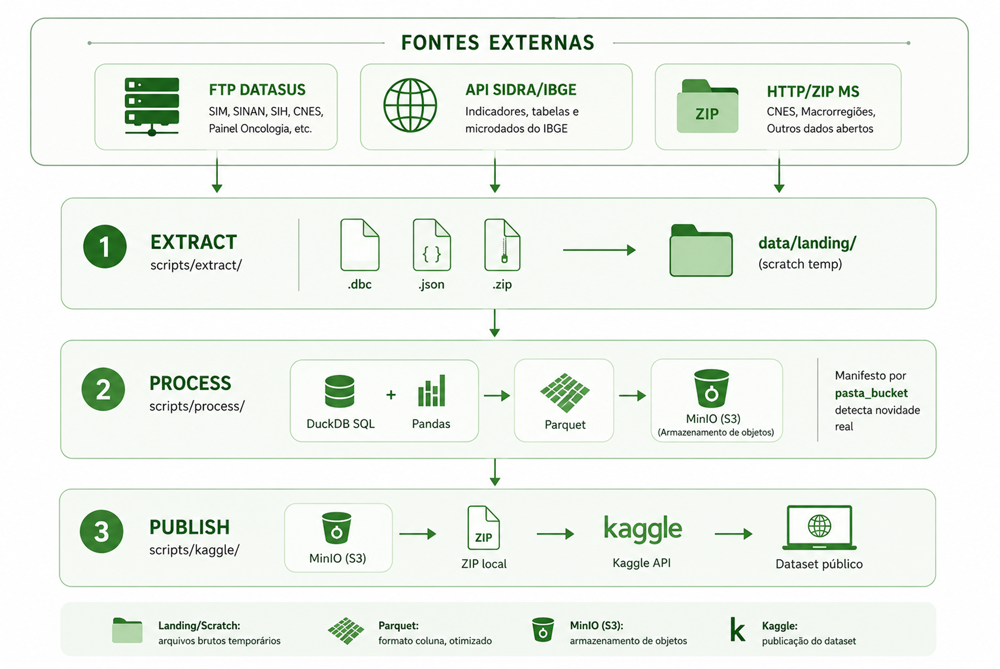

[](LICENSE)
[](https://www.kaggle.com/datasets/rafatrindade/brazilian-kaggle-datahub)
[](https://github.com/rafa-trindade/kaggle-datahub)

O **DataHub Brasil** nasce de uma necessidade prática: dados públicos brasileiros de altíssimo valor existem, são gratuitos e são oficiais - mas estão espalhados entre sistemas diferentes do DATASUS, do IBGE, da ANS e do Portal de Dados Abertos do Ministério da Saúde, cada um com seu próprio protocolo de acesso, formato de arquivo e convenção de nomenclatura. Reunir qualquer análise minimamente ampla exige garimpar meia dúzia de fontes antes de escrever a primeira linha de código de análise.

Este é um hub bruto e geral de dados públicos do Brasil: mortalidade, nascimentos, rede assistencial completa (estabelecimentos, habilitações, leitos, profissionais, equipamentos, serviços especializados, equipes), internações hospitalares, dezenas de doenças de notificação compulsória, Síndrome Respiratória Aguda Grave (SRAG), saúde suplementar (beneficiários de planos de saúde, operadoras, ressarcimento ao SUS), população e PIB por município além dos microdados completos da Pesquisa Nacional de Saúde - sem recorte temático, sem filtro de especialidade, sem viés de pesquisa específica. A ideia é justamente o oposto de um recorte: publicar cada sistema por completo, do jeito mais próximo possível do dado oficial, para que qualquer pesquisador possa aplicar seu próprio filtro.

O [dataset final](https://www.kaggle.com/datasets/rafatrindade/brazilian-kaggle-datahub) está disponível no Kaggle, com um [notebook de exemplo](https://www.kaggle.com/code/rafatrindade/taxa-de-incid-ncia-de-doen-as-por-munic-pio) demonstrando como cruzar as bases (doenças de notificação compulsória e população, por município) para calcular taxa de incidência por 100 mil habitantes. Cobre diferentes dimensões da saúde pública e demografia do Brasil: desde onde a rede está habilitada a atender e quantos leitos ela tem, até quem nasce, quem morre, quais doenças são notificadas, e como a população e a economia de cada município evoluem ao longo do tempo. 

 A Produção Ambulatorial (SIA-PA), pelo seu volume, é publicada em um [dataset dedicado](https://www.kaggle.com/datasets/rafatrindade/sia-producao-ambulatorial) no Kaggle, particionado por competência mensal.

📄 [Documentação técnica oficial](https://github.com/rafa-trindade/kaggle-datahub/releases/download/docs-v1/documentacao.rar) do DATASUS/IBGE (dicionários, mapeamentos e layouts).

---

## 🏗️ Arquitetura do Pipeline



> Não existe uma pasta local persistida com o histórico completo de dados brutos. `data/landing/` é puramente um scratch space temporário - cada arquivo é baixado, processado e enviado direto ao bucket, com o local sendo apagado logo em seguida. A detecção de "isso já existe, não precisa reprocessar" é feita comparando contra um **manifesto** (`_manifest.json`) mantido no próprio bucket, não contra disco local.

---

## 💼 Aplicações 

Embora este pipeline seja de código aberto para a comunidade, a estruturação e manutenção de Data Lakes na área da saúde exige governança, segurança e customização. O **DataHub Brasil** pode ser o motor de dados da sua instituição. 

Casos de uso corporativos reais que podem ser construídos a partir desta arquitetura:
* **Hospitais e Operadoras de Saúde:** Cruzamento de dados de mortalidade (SIM) e nascimentos (SINASC) com bases internas para modelos preditivos de risco e dimensionamento de rede assistencial.
* **Healthtechs:** Alimentação automatizada de bancos de dados proprietários via pipelines customizados, utilizando os dados de infraestrutura do CNES e faturamento do SIA/SIH.
* **Indústria Farmacêutica e Pesquisa:** Mapeamento geolocalizado de incidência de doenças de notificação compulsória (SINAN) para direcionamento de estudos clínicos, campanhas e distribuição de medicamentos.

---

## 📊 Fontes de Dados e Escopo

### **1. Mortalidade (Fonte: SIM - DATASUS)**

O **Sistema de Informações sobre Mortalidade (SIM)** consolida as Declarações de Óbito de todo o país desde 1979. Aqui, o SIM é publicado **por completo**, em todos os seus subsistemas, sem recorte por causa de óbito.

**Escopo e Processamento:** São baixados via FTP público do DATASUS os arquivos `.dbc` de cada subsistema, nas eras CID-9 (1979-1995) e CID-10 (1996-atual, quando aplicável), convertidos para Parquet e mesclados incrementalmente - execuções futuras só baixam e reprocessam o que for novo, sem reprocessar o histórico inteiro. Descoberta importante durante a construção: os subsistemas de Causas Externas, Óbitos Fetais, Óbitos Infantis e Óbitos Maternos não ficam em pastas próprias no FTP do DATASUS - todos dividem a mesma pasta física (nomeada "DOFET" por herança histórica), diferenciados só pelo prefixo do nome do arquivo.

**Bases disponibilizadas:**

- `declaracoes_de_obito_cid9.parquet` / `declaracoes_de_obito_cid10.parquet` - Declarações de óbito, todas as causas, 1979-1995 e 1996-atual.
- `declaracoes_de_obito_causas_externas_cid9.parquet` / `_cid10.parquet` - Óbitos por causas externas (acidentes, violência).
- `declaracoes_de_obito_fetais_cid9.parquet` / `_cid10.parquet` - Óbitos fetais.
- `declaracoes_de_obito_infantis_cid9.parquet` / `_cid10.parquet` - Óbitos infantis.
- `declaracoes_de_obito_maternos_cid10.parquet` - Óbitos maternos (só existe a partir de 1996, sem era CID-9).
- `declaracoes_de_obito_residentes_exterior_cid10.parquet` - Óbitos de brasileiros residentes no exterior (só a partir de 2013).

> BRASIL. Ministério da Saúde. DATASUS. *Sistema de Informações sobre Mortalidade (SIM)*. Brasília, DF: Ministério da Saúde. Disponível em: <https://datasus.saude.gov.br/mortalidade-desde-1996-pela-cid-10>.

---

### **2. Nascimentos (Fonte: SINASC - DATASUS)**

O **Sistema de Informações sobre Nascidos Vivos (SINASC)** é o equivalente do SIM para nascimentos - a base oficial de natalidade do Brasil desde 1996 (com dados pré-1996 também disponíveis).

**Escopo e Processamento:** Baixado via FTP público do DATASUS, com uma descoberta relevante durante a construção: a pasta `SINASC/NOV/DNRES` (aparentemente o caminho "principal") está **desatualizada** em relação à pasta `SINASC/1996_/Dados/DNRES`, que é a de fato mantida corrente - o pipeline usa a segunda. Os arquivos consolidados nacionais por ano (`DNBR{AAAA}.dbc`) são deliberadamente excluídos do processamento por duplicarem integralmente os nascimentos já presentes nos arquivos por UF (confirmado empiricamente, contagem exata).

**Bases disponibilizadas:**

- `declaracoes_de_nascido_vivo.parquet` - Nascidos vivos por UF, 1994-atual.
- `declaracoes_de_nascido_vivo_exterior.parquet` - Brasileiros nascidos no exterior, registrados no sistema.

> BRASIL. Ministério da Saúde. DATASUS. *Sistema de Informações sobre Nascidos Vivos (SINASC)*. Brasília, DF: Ministério da Saúde. Disponível em: <https://datasus.saude.gov.br/nascidos-vivos-desde-1994/>.

---

### **3. Rede Assistencial Completa (Fonte: CNES - DATASUS)**

O **Cadastro Nacional de Estabelecimentos de Saúde (CNES)** é o registro oficial de todos os estabelecimentos de saúde do Brasil. Aqui, cada arquivo do CNES é publicado **por completo, sem filtro de especialidade**, mantendo a granularidade original de cada sistema.

**Escopo e Processamento:** O cadastro de Estabelecimentos vem via HTTP/ZIP dos Dados Abertos do Ministério da Saúde. Habilitações, Leitos, Profissionais, Equipamentos, Serviços Especializados e Equipes vêm via FTP, organizados por UF e competência - como o CNES é um **retrato** (não uma série histórica que acumula), cada nova competência **substitui por completo** a anterior, ao contrário do padrão de mesclagem incremental usado no SIM/SINASC.

**Bases disponibilizadas:**

- `estabelecimentos_de_saude.parquet` - Cadastro geral: identificação, endereço, CNPJ, infraestrutura.
- `habilitacoes.parquet` - Todas as habilitações de todos os estabelecimentos, todas as especialidades.
- `leitos.parquet` - Contagem de leitos por estabelecimento e tipo.
- `profissionais.parquet` - Profissionais de saúde cadastrados (CBO, carga horária, forma de contratação).
- `equipamentos.parquet` - Equipamentos cadastrados por estabelecimento (raio-X, ressonância, tomógrafo etc).
- `servicos_especializados.parquet` - Serviços especializados e classificações oferecidos por estabelecimento (oncologia, nefrologia, reabilitação etc.), com indicação de atendimento SUS/não-SUS (arquivos `SR` do FTP).
- `equipes.parquet` - Equipes de saúde por estabelecimento (Saúde da Família, Atenção Primária, Saúde Bucal, eMulti etc.), com tipo de equipe, área e INE (arquivos `EP` do FTP).

> BRASIL. Ministério da Saúde. DATASUS. *Cadastro Nacional de Estabelecimentos de Saúde (CNES)*. Brasília, DF: Ministério da Saúde. Disponível em: <https://cnes.datasus.gov.br/>.

---

### **4. Internações Hospitalares (Fonte: SIH/SUS - DATASUS)**

O **Sistema de Informações Hospitalares (SIH/SUS)** registra todas as internações realizadas pelo SUS, com diagnósticos, procedimentos, valores e tempo de permanência.

**Escopo e Processamento:** Cobre a série moderna (2008-atual) - a série anterior (1992-2007) foi deixada de fora por decisão de escopo, dado o volume já considerável só na série recente (~6.000 arquivos por subsistema, um por UF/mês). São publicados os 3 subsistemas que compõem o SIH: internações aprovadas, rejeitadas, e os atos médicos associados.

**Bases disponibilizadas:**

- `aih_reduzida.parquet` - Internações aprovadas para pagamento pelo SUS (RD).
- `aih_rejeitada.parquet` - Internações rejeitadas para pagamento (RJ).
- `servicos_profissionais.parquet` - Atos médicos realizados durante as internações (SP).

> BRASIL. Ministério da Saúde. DATASUS. *Sistema de Informações Hospitalares do SUS (SIH/SUS)*. Brasília, DF: Ministério da Saúde. Disponível em: <https://datasus.saude.gov.br/acesso-a-informacao/producao-hospitalar-sih-sus/>.

---

### **5. Informações Ambulatoriais  (Fonte: SIA/SUS - DATASUS)**

O **Sistema de Informações Ambulatoriais (SIA/SUS)** registra toda a produção ambulatorial do SUS - de procedimentos de baixa complexidade (BPA) às autorizações de procedimentos de alta complexidade (APAC): quimioterapia, radioterapia, diálise, medicamentos especializados, entre outros.

**Escopo e Processamento:** Baixados via FTP público do DATASUS os arquivos `.dbc` de cada subsistema (um por UF/mês), diferenciados pelo prefixo do nome do arquivo, convertidos para Parquet e mesclados incrementalmente - mesma mecânica do SIM/SIH. A série moderna vive em `SIASUS/200801_/Dados`; a Produção Ambulatorial (PA), por começar em Jul/1994, também é varrida na pasta legada `SIASUS/199407_200712/Dados`. Alguns prefixos são prefixo um do outro (ex.: `AB` vs `ABO`), então o filtro valida o comprimento exato de `{UF}{AAMM}` para não haver captura cruzada.

**Bases disponibilizadas:**

- `producao_ambulatorial/` - Produção ambulatorial (BPA), Jul/1994-atual. **Particionada por competência** (ver nota abaixo).
- `apac_medicamentos.parquet` - APAC de medicamentos, Jan/2008-atual.
- `apac_quimioterapia.parquet` - APAC de quimioterapia, Jan/2008-atual.
- `apac_radioterapia.parquet` - APAC de radioterapia, Jan/2008-atual.
- `apac_tratamento_dialitico.parquet` - APAC de tratamento dialítico, Jun/2014-atual.
- `apac_nefrologia.parquet` - APAC de nefrologia, Jan/2008 a Out/2014 (substituída pela ATD).
- `apac_laudos_diversos.parquet` - APAC de laudos diversos, Jan/2008-atual.
- `psicossocial.parquet` - RAAS Psicossocial (CAPS), Jan/2013-atual.
- `atencao_domiciliar.parquet` - RAAS de Atenção Domiciliar (SAD), Nov/2012-atual.
- `apac_confeccao_fistula.parquet` - APAC de confecção de fístula arteriovenosa, Jun/2014-atual.
- `apac_cirurgia_bariatrica.parquet` - APAC de acompanhamento a cirurgia bariátrica, Jan/2008 a Mar/2013.
- `apac_pos_cirurgia_bariatrica.parquet` - APAC de acompanhamento pós cirurgia bariátrica, Abr/2013-atual.

#### Nota sobre a Produção Ambulatorial (PA)

A PA é, de longe, a maior base do DATASUS: mais de 10 mil arquivos `.dbc` e dezenas de GB, com série desde Jul/1994. Por isso ela recebe um tratamento distinto das demais fontes, que viram um único parquet consolidado:

- **Particionamento por competência.** Em vez de um único `producao_ambulatorial.parquet`, a PA é publicada como uma pasta `producao_ambulatorial/` contendo um parquet por competência mensal, nomeado `producao_ambulatorial_AAAAMM.parquet` (ex.: `producao_ambulatorial_202604.parquet`). O ano de 4 dígitos faz a ordenação alfabética coincidir com a cronológica. Competências grandes que o DATASUS fatia em partes (ex.: `PASP2401a/b.dbc`) são unificadas no parquet daquela competência.
- **Incremental barato.** Cada execução reescreve apenas as competências novas ou revisadas, não o dataset inteiro - essencial dado o volume. Como o DATASUS revisa meses recentes silenciosamente, além do que muda de tamanho reprocessa-se sempre uma margem de segurança das competências mais recentes.
- **Processamento fatiável (backfill).** O primeiro processamento completo é pesado (dezenas de GB, potencialmente horas/dias). Para ter controle e retomada, o `process` do PA aceita filtros de janela que processam exatamente o período pedido (sem margem e ignorando o manifesto): `--ano 2024`, `--competencia 202401`, ou `--de 202001 --ate 202412`. Sem filtro, roda no modo incremental de rotina. Além disso, o manifesto é salvo em checkpoints periódicos e ao ser interrompido (Ctrl+C), então uma execução interrompida retoma de onde parou.
- **Manifesto próprio.** A PA mantém seu próprio `producao_ambulatorial/_manifest.json` (arquivo-fonte → tamanho), independente do manifesto das outras fontes do SIA.
- **Dataset Kaggle dedicado.** Pelo volume (que sozinho se aproxima do teto de 200 GB do Kaggle) e pelo modelo de publicação "tudo ou nada" do dataset principal, a PA é publicada num **dataset Kaggle separado** (`sia-producao-ambulatorial`), vinculado ao principal por descrição. Isso isola o custo de reenvio e protege a estabilidade do dataset principal.


> BRASIL. Ministério da Saúde. DATASUS. *Sistema de Informações Ambulatoriais do SUS (SIA/SUS)*. Brasília, DF: Ministério da Saúde. Disponível em: <https://datasus.saude.gov.br/acesso-a-informacao/producao-ambulatorial-sia-sus/>.

---

### **6. Comunicação Hospitalar e Ambulatorial (Fonte: CIHA - DATASUS)** 

O **Sistema de Comunicação de Informação Hospitalar e Ambulatorial (CIHA)** registra internações e atendimentos ambulatoriais comunicados ao SUS, incluindo a produção **não-SUS** (particular e planos de saúde) - o que o torna complementar ao SIH/SIA, restritos à produção paga pelo SUS. Sucede o antigo CIH (2008-2010).

**Escopo e Processamento:** Baixado via FTP público do DATASUS (`CIHA/201101_/Dados`, arquivos `CIHA{UF}{AAMM}.dbc`, um por UF/mês), convertido para Parquet e mesclado incrementalmente - mesma mecânica do SIM/SIH. Série acumulativa a partir de Jan/2011.

**Base disponibilizada:**

- `comunicacao_internacao_hospitalar_ambulatorial.parquet` - Internações e atendimentos comunicados (inclui não-SUS), Jan/2011-atual.

> BRASIL. Ministério da Saúde. DATASUS. *Sistema de Comunicação de Informação Hospitalar e Ambulatorial (CIHA)*. Brasília, DF: Ministério da Saúde. Disponível em: <http://ciha.datasus.gov.br/CIHA/index.php>.

---

### **7. Doenças de Notificação Compulsória (Fonte: SINAN - DATASUS)**

O **Sistema de Informação de Agravos de Notificação (SINAN)** registra todas as doenças e agravos de notificação obrigatória no Brasil - de arboviroses a doenças ocupacionais, de violência interpessoal a doenças quase erradicadas mantidas sob vigilância ativa.

**Escopo e Processamento:** Diferente do SIM/SIH, o SINAN não é dividido por UF - cada agravo tem um único arquivo por ano, nível Brasil. São cobertos **58 agravos**, cada um publicado como um Parquet **independente** (agravos diferentes têm estruturas de campos completamente diferentes entre si, então misturar tudo numa tabela só não faria sentido). A lista completa de agravos e seus respectivos códigos está documentada em `scripts/config/agravos_sinan.py` no repositório de código. Entre os destaques: as três arboviroses (dengue, chikungunya, zika), tuberculose, hanseníase, sífilis (adquirida/congênita/gestante), HIV e AIDS (notificados como 6 sistemas separados - adulto/criança/gestante para cada), e violência interpessoal/autoprovocada, publicada aqui **sem nenhum filtro** (todos os desfechos, todos os gêneros).

**Bases disponibilizadas:** 58 arquivos Parquet, um por agravo, nomeados de forma legível (ex: `dengue.parquet`, `tuberculose.parquet`, `violencia_interpessoal_autoprovocada.parquet`, `hiv_gestante.parquet`) - não pelas siglas técnicas do DATASUS.

> BRASIL. Ministério da Saúde. DATASUS. *Sistema de Informação de Agravos de Notificação (SINAN)*. Brasília, DF: Ministério da Saúde. Disponível em: <https://datasus.saude.gov.br/sinan/>.

---

### **8. Síndrome Respiratória Aguda Grave (Fonte: SIVEP-Gripe - Ministério da Saúde)**

O **SIVEP-Gripe** é o sistema de vigilância da **Síndrome Respiratória Aguda Grave (SRAG)**: registra casos hospitalizados e óbitos por SRAG, com resultado laboratorial (influenza, SARS-CoV-2, VSR e outros vírus respiratórios), sintomas, comorbidades, vacinação, internação em UTI e evolução. Não faz parte do SINAN (os 58 agravos acima não incluem influenza/SRAG/COVID-19), então preenche uma lacuna real do hub.

**Escopo e Processamento:** Obtido via HTTP do [Portal de Dados Abertos do Ministério da Saúde](https://dadosabertos.saude.gov.br/dataset?q=srag) (antigo OpenDataSUS), um arquivo por ano (`INFLUDAA`). O Ministério separa os anos em três conjuntos que acompanham três versões da ficha de notificação - por isso o hub publica **um parquet por era** (campos diferentes entre eras, iguais dentro de cada era). A partir de 2019 os arquivos são um **"banco vivo"**: anos recentes são republicados periodicamente com a data no nome (ex.: `INFLUD25-28-09-2026.parquet`). O pipeline descobre os conjuntos e os links a cada execução (API CKAN do portal, com fallback para as páginas HTML), confere o tamanho de cada ano contra o manifesto e só baixa/reprocessa os anos que mudaram - substituindo, dentro do parquet da era, as linhas daquele ano (coluna `_ARQUIVO_ORIGEM`). Todas as colunas são publicadas como texto, sem reinterpretação de tipos, como no restante do hub.

**Bases disponibilizadas:**

- `srag_2009_2012.parquet` - SRAG 2009-2012 (pandemia de H1N1 e anos seguintes).
- `srag_2013_2018.parquet` - SRAG 2013-2018.
- `srag_2019_atual.parquet` - SRAG 2019-atual (inclui todo o período da COVID-19), atualizado conforme o banco vivo.

> BRASIL. Ministério da Saúde. Secretaria de Vigilância em Saúde e Ambiente. *SRAG - Banco de Dados de Síndrome Respiratória Aguda Grave (SIVEP-Gripe)*. Brasília, DF: Ministério da Saúde. Disponível em: <https://dadosabertos.saude.gov.br/dataset/srag-2019-a-2026>.

---

### **9. Saúde Suplementar (Fonte: ANS)**

A **Agência Nacional de Saúde Suplementar (ANS)** regula os planos de saúde, que cobrem cerca de um quarto da população brasileira. Até aqui o hub cobria quase só o lado SUS (o CIHA mostra a produção não-SUS, mas não quem tem plano); a ANS completa o retrato: **quantos beneficiários de plano existem em cada município** (e, cruzando com `populacao_estimada`, a taxa de cobertura), quais operadoras atuam, e quantos atendimentos no SUS foram feitos a quem tem plano (**ressarcimento ao SUS**, cruzável com o SIH).

**Escopo e Processamento:** Baixado via HTTP da base TabNet da ANS (<https://dadosabertos.ans.gov.br/FTP/Base_de_dados/Microdados/dados_dbc/>, a mesma apontada na página ["Baixar base de dados"](https://www.gov.br/ans/pt-br/acesso-a-informacao/perfil-do-setor/dados-e-indicadores-do-setor/baixar-base-de-dados) da ANS). Os arquivos são `.dbc` no mesmo formato TabWin do DATASUS, então passam pela mesma conversão para Parquet. Séries que acumulam (trimestrais, mensais, anuais) são mescladas incrementalmente; tabelas que a ANS mantém só como retrato mais recente (taxa de cobertura, operadoras ativas, planos) são substituídas por completo a cada versão, como no CNES. As 12 tabelas, seus prefixos de arquivo e modos estão em `scripts/config/bases_ans.py`. Os campos vêm **codificados** (faixa etária, modalidade, tipo de contratação etc.); para decodificá-los use os [arquivos auxiliares `.def`/`.cnv` da ANS](https://dadosabertos.ans.gov.br/FTP/Base_de_dados/Microdados/arquivos_auxiliares_de_tab_def_e_cnv/) e a [documentação TabWin](https://www.gov.br/ans/pt-br/arquivos/acesso-a-informacao/perfil-do-setor/dados-e-indicadores-do-setor/baixar-base-de-dados/documentacao_tabwin.zip).

**Bases disponibilizadas:**

- `beneficiarios_por_municipio.parquet` - Beneficiários por município, operadora, faixa etária, sexo e tipo de plano. Trimestral, Mar/2000-atual.
- `beneficiarios_por_uf_regiao_metropolitana_capital.parquet` - Beneficiários por UF, região metropolitana e capital. Trimestral, Mar/2000-atual.
- `beneficiarios_por_operadora.parquet` - Beneficiários por operadora. Trimestral, Jun/2011-atual.
- `taxa_de_cobertura.parquet` - Taxa de cobertura de planos de saúde (retrato mais recente).
- `mortalidade_por_operadora.parquet` - Série histórica descontinuada por operadora, 2004-2009.
- `ressarcimento_ao_sus.parquet` - Atendimentos no SUS a beneficiários de planos, identificados para ressarcimento. Anual, 2001-atual.
- `operadoras_ativas.parquet` - Operadoras com registro ativo (retrato mais recente).
- `receitas_e_despesas_operadoras.parquet` - Receita de contraprestações e despesas das operadoras. Anual, 2001-atual.
- `planos.parquet` - Planos de saúde registrados (retrato mais recente).
- `demandas_reclamacoes.parquet` - Reclamações de consumidores. Mensal, Jan/2010-atual.
- `demandas_nip.parquet` - Demandas via Notificação de Intermediação Preliminar (NIP). Mensal, Jan/2011-atual.
- `demandas_informacoes.parquet` - Pedidos de informação de consumidores. Mensal, Jan/2010-atual.

> AGÊNCIA NACIONAL DE SAÚDE SUPLEMENTAR (ANS). *Dados e Indicadores do Setor - Base de dados (TabNet)*. Rio de Janeiro: ANS. Disponível em: <https://www.gov.br/ans/pt-br/acesso-a-informacao/perfil-do-setor/dados-e-indicadores-do-setor>.

---

### **10. Demografia e Economia Municipal (Fonte: IBGE, via API SIDRA)**

O **IBGE**, via sua API pública SIDRA, disponibiliza séries anuais de população estimada e produto interno bruto por município.

**Escopo e Processamento:** Ambas as séries são obtidas ano a ano via API (não por download de arquivo), com descoberta dinâmica dos períodos realmente disponíveis em cada tabela - o IBGE costuma trocar o número da tabela quando muda a metodologia de cálculo (confirmado empiricamente ao longo da construção: uma tentativa inicial usou uma tabela que só cobria nível Brasil, não municipal).

**Bases disponibilizadas:**

- `populacao_estimada.parquet` - População estimada por município, 2001-atual (com lacunas nos anos de Censo/Contagem, quando a estimativa regular é substituída).
- `pib_municipal.parquet` - Produto Interno Bruto por município, 2002-atual.

> INSTITUTO BRASILEIRO DE GEOGRAFIA E ESTATÍSTICA (IBGE). *Sistema IBGE de Recuperação Automática (SIDRA)*. Rio de Janeiro: IBGE. Disponível em: <https://sidra.ibge.gov.br/>.

---

### **11. Microdados Completos da PNS (Fonte: IBGE)**

A **Pesquisa Nacional de Saúde (PNS)** é um inquérito domiciliar do IBGE com mais de 1.000 variáveis por edição, cobrindo desde diagnósticos autorreferidos até hábitos de vida e acesso a serviços de saúde.

**Escopo e Processamento:** Aqui os microdados de posição fixa são publicados **exatamente como o IBGE distribui** - sem decodificar nenhuma variável, sem recorte temático. Mapear as mais de 1.000 posições de cada edição não agregaria valor suficiente para este hub geral; quem for usar precisa do dicionário oficial de posições do IBGE para decodificar campo a campo.

**Bases disponibilizadas:**

- `microdados_pns_2013.txt` / `microdados_pns_2019.txt` - Microdados brutos de posição fixa, tal como distribuídos pelo IBGE.

*Observação: por serem arquivos volumosos e sujeitos aos termos de uso de download do IBGE, os microdados brutos são obtidos manualmente, não via automação.*

> INSTITUTO BRASILEIRO DE GEOGRAFIA E ESTATÍSTICA (IBGE). *Pesquisa Nacional de Saúde (PNS)*. Rio de Janeiro: IBGE. Disponível em: <https://www.ibge.gov.br/estatisticas/sociais/saude/9160-pesquisa-nacional-de-saude.html>.

---

### **12. Base Auxiliar (Macrorregião de Saúde)**

Para permitir cruzamentos geográficos entre as demais bases, o projeto conta com uma base auxiliar de referência, construída a partir de dados abertos do Ministério da Saúde.

**Escopo e Processamento:** O arquivo de municípios (Dados Abertos da Saúde) é combinado, via join no código do município (com correção de zero à esquerda), com um arquivo complementar de geolocalização.

**Base disponibilizada:**

- `macroregiao_de_saude.parquet` - Municípios brasileiros associados às suas macrorregiões de saúde, regiões de saúde e coordenadas geográficas.

---

## 🗓️ Cobertura Histórica

- **SIM (mortalidade):** 1979-atual, todos os 6 subsistemas.
- **SINASC (nascimentos):** 1994-atual.
- **CNES (rede assistencial):** retrato da competência mais recente disponível (não histórico).
- **SIH/SUS (internações):** 2008-atual (série moderna).
- **SIA/SUS (produção ambulatorial):** varia por subsistema - PA desde Jul/1994, APACs em geral desde Jan/2008; ver a seção da fonte para o intervalo de cada base.
- **CIHA (comunicação hosp./ambulatorial):** 2011-atual.
- **SINAN (agravos):** varia por agravo, geralmente a partir dos anos 2000; consultar `agravos_sinan.py` para o início exato de cada um.
- **SRAG (SIVEP-Gripe):** 2009-atual, em três eras (2009-2012, 2013-2018, 2019-atual).
- **ANS (saúde suplementar):** beneficiários desde 2000 (trimestral), ressarcimento ao SUS e receitas/despesas desde 2001 (anual), demandas de consumidores desde 2010 (mensal); taxa de cobertura, operadoras ativas e planos como retrato mais recente.
- **IBGE (população/PIB):** população desde 2001, PIB desde 2002.
- **PNS/IBGE:** edições pontuais de 2013 e 2019.

---

## 🔄 Atualização e Confiabilidade

- **SIM, SINASC, CNES, SIH, SINAN, CIHA:** sincronização totalmente automatizada via FTP, com detecção de novidade real (por tamanho de arquivo) antes de reprocessar ou publicar.
- **SIA/SUS:** sincronização automatizada via FTP, mesma mecânica das demais fontes DATASUS.
- **IBGE (População/PIB):** sincronização automatizada via API, ano a ano, com descoberta dinâmica de quais anos a tabela realmente cobre.
- **PNS/IBGE:** obtenção do microdado bruto é manual; a publicação (upload, sem transformação) é automatizada.
- **Macrorregião de Saúde:** sincronização automatizada via HTTP.
- **SRAG:** sincronização automatizada via HTTP, com descoberta dinâmica dos conjuntos e arquivos no portal (o "banco vivo" é republicado com nome datado) e detecção de novidade por tamanho, ano a ano.
- **ANS:** sincronização automatizada via HTTP (índice de diretório da ANS), com detecção de novidade por tamanho de cada `.dbc` contra o manifesto - inclusive revisões de anos/meses já publicados.

O pipeline só publica uma nova versão (bucket + Kaggle) quando pelo menos uma fonte automatizada reporta dado novo de verdade.

---

## 📁 Estrutura de Pastas do Dataset

```
sim/
  declaracoes_de_obito_cid9.parquet
  declaracoes_de_obito_cid10.parquet
  declaracoes_de_obito_causas_externas_cid9.parquet
  declaracoes_de_obito_causas_externas_cid10.parquet
  declaracoes_de_obito_fetais_cid9.parquet
  declaracoes_de_obito_fetais_cid10.parquet
  declaracoes_de_obito_infantis_cid9.parquet
  declaracoes_de_obito_infantis_cid10.parquet
  declaracoes_de_obito_maternos_cid10.parquet
  declaracoes_de_obito_residentes_exterior_cid10.parquet

sinasc/
  declaracoes_de_nascido_vivo.parquet
  declaracoes_de_nascido_vivo_exterior.parquet

cnes/
  estabelecimentos_de_saude.parquet
  habilitacoes.parquet
  leitos.parquet
  profissionais.parquet
  equipamentos.parquet
  servicos_especializados.parquet
  equipes.parquet

sih/
  aih_reduzida.parquet
  aih_rejeitada.parquet
  servicos_profissionais.parquet

sia/                                   
  apac_medicamentos.parquet
  apac_quimioterapia.parquet
  apac_radioterapia.parquet
  apac_tratamento_dialitico.parquet
  apac_nefrologia.parquet
  apac_laudos_diversos.parquet
  psicossocial.parquet
  atencao_domiciliar.parquet
  apac_confeccao_fistula.parquet
  apac_cirurgia_bariatrica.parquet
  apac_pos_cirurgia_bariatrica.parquet

producao_ambulatorial/                  
  producao_ambulatorial_199407.parquet
  producao_ambulatorial_199408.parquet
  ...
  producao_ambulatorial_202604.parquet
  _manifest.json

ciha/                                   
  comunicacao_internacao_hospitalar_ambulatorial.parquet

sinan/
  dengue.parquet, tuberculose.parquet, hanseniase.parquet, ...
  (58 arquivos no total -- lista completa em scripts/config/agravos_sinan.py)

srag/
  srag_2009_2012.parquet
  srag_2013_2018.parquet
  srag_2019_atual.parquet

ans/
  beneficiarios_por_municipio.parquet
  beneficiarios_por_uf_regiao_metropolitana_capital.parquet
  beneficiarios_por_operadora.parquet
  taxa_de_cobertura.parquet
  mortalidade_por_operadora.parquet
  ressarcimento_ao_sus.parquet
  operadoras_ativas.parquet
  receitas_e_despesas_operadoras.parquet
  planos.parquet
  demandas_reclamacoes.parquet
  demandas_nip.parquet
  demandas_informacoes.parquet
  (lista completa, prefixos e modos em scripts/config/bases_ans.py)

geo/
  macroregiao_de_saude.parquet

ibge/
  populacao_estimada.parquet
  pib_municipal.parquet
  microdados_pns_2013.txt
  microdados_pns_2019.txt

metadados.csv          -- manifesto de todos os arquivos: fonte(s), tamanho,
                           contagem de registros, data de modificação
```

Uma cópia local do `metadados.csv` também fica versionada em `data/metadados.csv`
neste repositório -- único arquivo persistente em `data/` (todo o resto é
scratch space temporário, ver Arquitetura do Pipeline acima).

---

## 🧭 Roadmap

Bases mapeadas para as próximas versões do hub. Nada aqui é publicado ainda - o status indica onde cada uma está.

| Status | Significado |
|---|---|
| 🚧 **em implementação** | escopo definido; próxima a entrar no pipeline |
| 🔎 **em avaliação** | precisa de checagem (disponibilidade, volume, layout) antes de entrar |
| 💾 **aguardando espaço** | relevante, mas o volume exige mais espaço no Data Lake e/ou dataset Kaggle dedicado |

### ANS - Plano de Dados Abertos (PDA)

Além da base TabNet (já publicada, seção 9), a ANS mantém um portal maior em <https://dadosabertos.ans.gov.br/FTP/PDA/>, com mais de 50 conjuntos em CSV/ZIP. Mapeamento atual:

**Bases menores (candidatas ao dataset principal):**

| Status | Conjunto (pasta no PDA) | Conteúdo | Volume observado |
|---|---|---|---|
| 🚧 em implementação | `operadoras_de_plano_de_saude_ativas` / `_canceladas` | Cadastro completo de operadoras (CADOP: CNPJ, modalidade, endereço) - dimensão para todas as tabelas da ANS | ~340 KB (retrato diário) |
| 🚧 em implementação | `SIP` | Mapa assistencial: procedimentos e eventos realizados pelos planos, por operadora | ~1 MB/trimestre, 2020-2025 |
| 🚧 em implementação | `hc_ressarcimento_sus` | Ressarcimento ao SUS por operadora (HC), complementar ao `ressarcimento_ao_sus.parquet` | ~800 KB/ano, 2018-atual |
| 🚧 em implementação | `demonstracoes_contabeis` | Demonstrações contábeis das operadoras | pastas anuais, 2001-atual |
| 🚧 em implementação | `ressarcimento_ao_SUS_cobranca_arrecadacao`, `ressarcimento_ao_SUS_indice_efetivo_pagamento` | Cobrança, arrecadação e índice de pagamento do ressarcimento | pequeno |
| 🚧 em implementação | `historico_idss-020`, `taxa_de_resolutividade`, `penalidades_aplicadas_a_operadoras`, `regimes_especiais_direcao_tecnica` | Qualidade, resolutividade e fiscalização das operadoras | pequeno |
| 🔎 em avaliação | `terminologia_unificada_saude_suplementar_TUSS-049` | Tabela TUSS (procedimentos, materiais, medicamentos) - dimensão para o TISS | a medir |
| 🔎 em avaliação | `caracteristicas_produtos_saude_suplementar-008`, `historico_planos_saude`, `servicos_opcionais_planos_saude`, `area_comercializacao_planos_ntrp`, `faixa_de_preco`, `valor_comercial_medio_por_municipio_NTRP-054`, `nota_tecnica_ntrp_vcm_faixa_etaria`, `percentuais_de_reajuste_de_agrupamento-055`, `painel_precificacao-031` | Produtos, preços e reajustes dos planos | a medir |
| 🔎 em avaliação | `painel_de_glosas-057`, `peona_sus`, `solicitacoes_alteracao_rede_hospitalar-046`, `operadoras_acreditadas`, `prestadores_acreditados`, `operadoras_e_prestadores_nao_hospitalares`, `monitoramento_garantia_atendimento`, `classificacao_prudencial-056`, `promoprev-052`, `beneficiarios_vinculos_tipo_contratacao_vda`, `dados_de_beneficiarios_por_operadora`, `dados_de_beneficiarios_por_regiao_geografica`, `taxa_de_cobertura_de_planos_de_saude-047`, `dados_consolidados_da_saude_suplementar`, `caderno_de_informacao`, `quadros_auxiliares_de_corresponsabilidade`, `programa_de_qualificacao_institucional`, `IAP`, `IGR`, `PFA`, `RPC` | Demais indicadores, painéis e agregados (parte deles sobreposta à base TabNet já publicada - avaliar duplicidade) | a medir |

**Bases volumosas (candidatas a dataset Kaggle dedicado, como a PA):**

| Status | Conjunto (pasta no PDA) | Conteúdo | Volume observado |
|---|---|---|---|
| 🔎 em avaliação | `TISS/HOSPITALAR`, `TISS/AMBULATORIAL` | Produção assistencial da saúde suplementar (o "SIH/SIA dos planos"): guias consolidadas, detalhadas e de remuneração, por UF e mês, 2015-2025 | só SP/2024: ~0,25 GB (hospitalar) e ~9,4 GB (ambulatorial) zipados - Brasil inteiro chega a dezenas/centenas de GB |
| 🔎 em avaliação | `informacoes_consolidadas_de_beneficiarios-024` | Beneficiários consolidados por UF/mês, mais granular que a base TabNet, Mai/2021-atual | ~400 MB zipado por mês (~25 GB no total) |
| 🔎 em avaliação | `produtos_e_prestadores_hospitalares` | Rede hospitalar vinculada a cada plano | ~1,4 GB zipado (retrato) |
| 🔎 em avaliação | `beneficiarios_identificados_sus_abi` | Beneficiários identificados em atendimentos no SUS (ABI) | a medir |

Fora do escopo (administrativos, sem valor analítico): `agenda_de_autoridades`, `plano_anual_de_atividades_da_auditoria_interna_PAINT`, `glossario_saude_suplementar`, `dataset_teste`.

### Ministério da Saúde / DATASUS

| Status | Base | Observação |
|---|---|---|
| 🔎 em avaliação | **SI-PNI** - doses aplicadas do Programa Nacional de Imunizações ([Portal de Dados Abertos](https://dadosabertos.saude.gov.br/)) | Microdados por dose aplicada, arquivos anuais/mensais muito volumosos. Medir o volume total e avaliar publicação em **dataset Kaggle separado**, nos moldes da Produção Ambulatorial. |

---

## 📥 Baixando as Bases

Para quem só quer **consumir** os dados, há um utilitário pronto na pasta [`download-datasets/`](download-datasets/) que baixa bases específicas - ou todas - direto dos datasets no Kaggle, via API.

- Suporta os dois datasets: **principal** (`brazilian-kaggle-datahub`) e **PA** (`sia-producao-ambulatorial`).
- Baixa tudo, uma base específica, várias, ou - no caso da Produção Ambulatorial - um intervalo de competências (ex.: todo o ano de 2024) via `PA_DE` / `PA_ATE`.
- O passo a passo completo (incluindo como obter a chave da API do Kaggle e onde colocá-la) está no [`download-datasets/README.md`](download-datasets/README.md).

```bash
cd download-datasets
python baixar_dataset.py           # baixa conforme a configuração no topo do script
python baixar_dataset.py --listar  # lista os arquivos disponíveis no dataset
```

---

## 🛠️ Stack Tecnológico

| Camada | Tecnologia |
|---|---|
| Linguagem | Python 3.11 |
| Processamento analítico | DuckDB |
| Manipulação de dados | Pandas |
| Armazenamento (Data Lake) | MinIO - Object Storage compatível com S3 |
| Comunicação S3 | boto3 |
| Distribuição | Kaggle Python SDK (`kaggle`) |
| Configuração | python-dotenv |

---

## 📄 Licença e Créditos

Este projeto opera sob um modelo duplo de licenciamento, separando a engenharia de software dos dados públicos:

1. **Código-fonte e Arquitetura:** O pipeline de extração, os scripts de processamento e a infraestrutura como código deste repositório estão licenciados sob a **GNU GPLv3**. Você é livre para usar, estudar e modificar o código, desde que qualquer software derivado ou modificação também seja obrigatoriamente de código aberto sob a mesma licença.
2. **Dataset Consolidado:** Os arquivos de dados gerados e publicados no Kaggle são disponibilizados sob licença **CC0 1.0** (domínio público), referindo-se estritamente ao trabalho de curadoria, padronização e harmonização.

Os dados originais permanecem de titularidade e responsabilidade das instituições abaixo, que devem ser citadas ao utilizar cada fonte individualmente:

- **DATASUS (SIM, SINASC, CNES, SIH/SUS, SIA/SUS, CIHA, SINAN):**
  > BRASIL. Ministério da Saúde. DATASUS. Brasília, DF: Ministério da Saúde. Disponível em: <https://datasus.saude.gov.br/>.

- **IBGE (População, PIB, PNS):**
  > INSTITUTO BRASILEIRO DE GEOGRAFIA E ESTATÍSTICA (IBGE). Rio de Janeiro: IBGE. Disponível em: <https://www.ibge.gov.br/>.

- **Ministério da Saúde - Portal de Dados Abertos (SRAG/SIVEP-Gripe, CNES Estabelecimentos, Macrorregiões):**
  > BRASIL. Ministério da Saúde. Portal de Dados Abertos da Saúde. Brasília, DF: Ministério da Saúde. Disponível em: <https://dadosabertos.saude.gov.br/>.

- **ANS (Saúde Suplementar):**
  > AGÊNCIA NACIONAL DE SAÚDE SUPLEMENTAR (ANS). Rio de Janeiro: ANS. Disponível em: <https://www.gov.br/ans/>.

Se você utilizar este dataset em pesquisas, reportagens ou análises, considere citar tanto a fonte original relevante (acima) quanto este repositório de curadoria.

---

#### **Idealização e manutenção:**
- [Rafael Trindade](https://www.linkedin.com/in/rafatrindade/)
